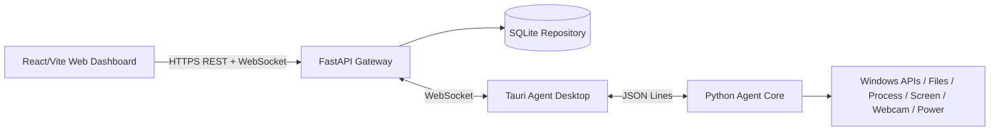
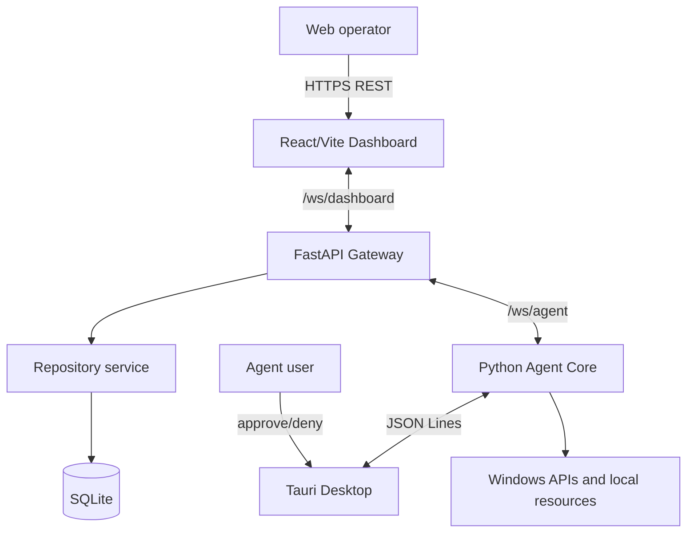
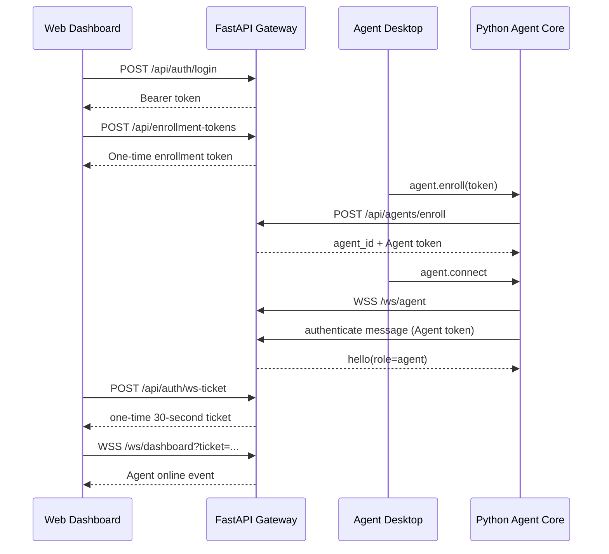
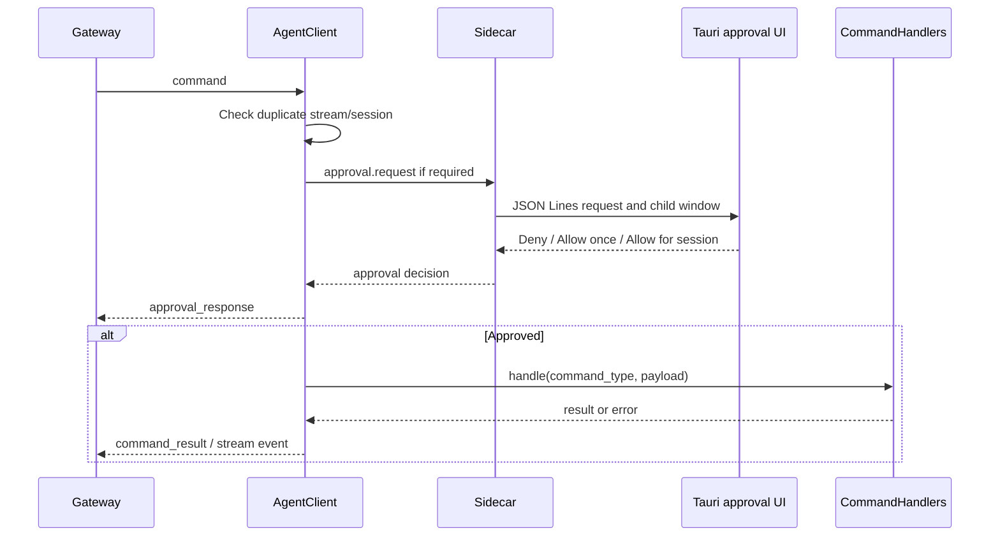
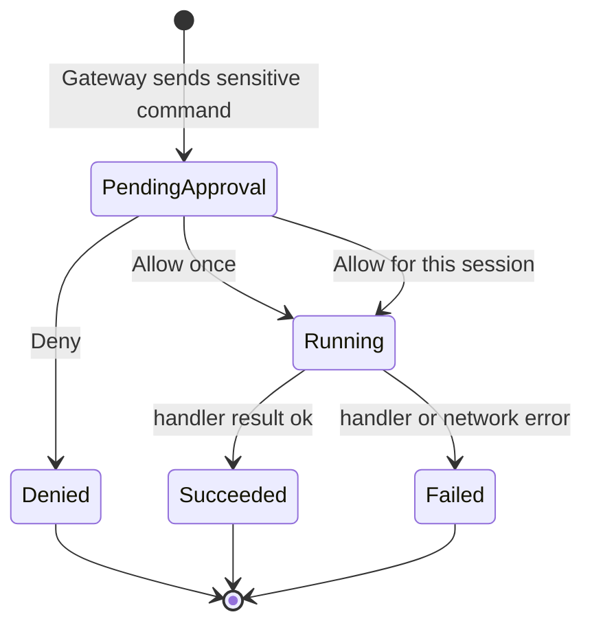

# RemoteCtrl
## Nền tảng điều khiển và giám sát máy tính từ xa

> Báo cáo kỹ thuật đồ án môn Mạng máy tính. Nội dung được tổng hợp từ source code, test, script và tài liệu trong repository. Thông tin chưa xác minh được đánh dấu `[CẦN BỔ SUNG]`.

## Mục lục

1. [Thông tin nhóm](#1-thông-tin-nhóm)
2. [Kiến trúc và thiết kế hệ thống](#2-kiến-trúc-và-thiết-kế-hệ-thống)
3. [Chi tiết triển khai hệ thống](#3-chi-tiết-triển-khai-hệ-thống)
4. [Protocol và API](#4-protocol-và-api)
5. [Bảo mật và Consent](#5-bảo-mật-và-consent)
6. [Quá trình phát triển](#6-quá-trình-phát-triển)
7. [Hạn chế và hướng phát triển](#7-hạn-chế-và-hướng-phát-triển)
8. [Thông tin cần bổ sung](#8-thông-tin-cần-bổ-sung)
9. [Ma trận yêu cầu và căn cứ](#9-ma-trận-yêu-cầu-module-và-căn-cứ-triển-khai)
10. [Quy trình xây dựng từng bước](#10-quy-trình-xây-dựng-remotectrl-theo-từng-bước)
11. [Protocol, networking và complexity](#11-protocol-networking-và-complexity)
12. [Hạn chế kỹ thuật chi tiết](#12-hạn-chế-rủi-ro-và-hướng-cải-tiến-theo-ưu-tiên)
13. [Mapping source và ảnh minh họa](#13-mapping-báo-cáo-source-và-ảnh-minh-họa-cần-bổ-sung)

## 1. Thông tin nhóm

| Thành viên | MSSV | Vai trò/đóng góp | Tỷ lệ |
|---|---|---|---|
| `[CẦN BỔ SUNG]` | `[CẦN BỔ SUNG]` | Backend, WebSocket và database | `[CẦN BỔ SUNG]` |
| `[CẦN BỔ SUNG]` | `[CẦN BỔ SUNG]` | Web Dashboard và UI realtime | `[CẦN BỔ SUNG]` |
| `[CẦN BỔ SUNG]` | `[CẦN BỔ SUNG]` | Agent, desktop UI và kiểm thử | `[CẦN BỔ SUNG]` |

### Tổng quan đồ án

RemoteCtrl là nền tảng điều khiển và hỗ trợ máy tính từ xa, được xây dựng cho đồ án môn Mạng máy tính. Hệ thống gồm Web Dashboard dành cho người vận hành, FastAPI Gateway làm trung gian và Windows Agent chạy trên máy được quản lý.

Mục tiêu chính:

- Minh họa kết nối mạng hai chiều giữa Web, Gateway và Agent.
- Định tuyến command tới đúng thiết bị.
- Truyền dữ liệu realtime qua WebSocket.
- Ghi nhận lịch sử thao tác bằng audit log.
- Bảo vệ người dùng bằng mô hình `consent-first`.

Agent user phải nhìn thấy yêu cầu và lựa chọn cho phép hoặc từ chối trước khi thao tác nhạy cảm được thực thi.

### Phạm vi đã triển khai

- Login và authentication.
- Enrollment token.
- Agent connect, disconnect và reconnect.
- Multi-Agent routing.
- Applications và Processes.
- Screen screenshot/live stream.
- Webcam diagnostics, snapshot/live stream.
- Files và allowed folders.
- Visible Activity Capture.
- Power status và dry-run/real mode.
- Audit log.
- WebSocket realtime.
- Tauri desktop Agent.
- Python sidecar đóng gói bằng PyInstaller.
- NSIS installer.
- Public Render deployment.

### Phạm vi chưa làm hoặc còn giới hạn

- Không có remote mouse/keyboard control.
- Không có hidden keylogger.
- Không có WebRTC.
- SQLite public demo có thể mất dữ liệu khi Render restart.
- Webcam phụ thuộc driver, quyền OS và WebView2.
- Installer chưa code-sign.
- Chưa có RBAC đầy đủ.
- Chưa có PostgreSQL production.
- Power thật chỉ nên được kiểm thử bằng mock trong QA tự động.
### Yêu cầu đồ án môn Mạng máy tính

Phần này ghi rõ các yêu cầu mà RemoteCtrl dùng để định hướng thiết kế và đánh giá hệ thống. Các yêu cầu được đối chiếu với source, test và tài liệu hiện có; yêu cầu nào phụ thuộc rubric riêng của lớp cần nhóm bổ sung.

#### Yêu cầu chức năng

| Mã | Yêu cầu | Cách RemoteCtrl đáp ứng | Trạng thái căn cứ |
|---|---|---|---|
| FR-01 | Có ứng dụng Web điều khiển từ xa | React/Vite Web Dashboard cung cấp login, chọn Agent, module và command UI. | Đã xác nhận từ source |
| FR-02 | Có chương trình chạy trên máy được điều khiển | Windows Agent Desktop dùng Tauri và Python Agent Core sidecar. | Đã xác nhận từ source |
| FR-03 | Kết nối qua một máy chủ trung gian | FastAPI Gateway nhận REST/WebSocket và route tới Agent. | Đã xác nhận từ source |
| FR-04 | Quản lý nhiều thiết bị | Agent registry và `agent_id` cho phép chọn đúng Agent. | Đã xác nhận từ source/test |
| FR-05 | Thực hiện command trên Agent | Applications, Processes, Screen, Webcam, Files, Activity và Power có command handler riêng. | Đã xác nhận từ source |
| FR-06 | Hiển thị kết quả | Agent gửi command result/event về Gateway; Web cập nhật realtime. | Đã xác nhận từ source |
| FR-07 | Ghi lại lịch sử thao tác | SQLite lưu commands và audit events. | Đã xác nhận từ source |
| FR-08 | Có cơ chế đồng ý của người dùng | Approval dialog hiển thị trên Agent trước thao tác nhạy cảm. | Đã xác nhận từ source/test |

#### Yêu cầu về Mạng máy tính

| Mã | Yêu cầu | Cách RemoteCtrl đáp ứng |
|---|---|---|
| NET-01 | Giao tiếp client-server qua mạng | Web và Agent giao tiếp với FastAPI Gateway qua HTTP/HTTPS. |
| NET-02 | Có kết nối hai chiều realtime | WebSocket được dùng cho dashboard và Agent. |
| NET-03 | Có định tuyến message | Gateway map `agent_id` tới WebSocket hiện tại. |
| NET-04 | Xác định đúng thiết bị đích | `command_id` và `agent_id` được kiểm tra trước khi nhận result/frame. |
| NET-05 | Xử lý mất kết nối | Agent có trạng thái online/offline và reconnect sau kết nối bất thường. |
| NET-06 | Truyền dữ liệu media | Screen/webcam frame được encode JPEG/base64 và truyền qua WebSocket. |
| NET-07 | Hiển thị đặc tính realtime | Web hiển thị FPS, frame count và latency ước tính. |
| NET-08 | Chạy được trong LAN/WAN demo | Agent dùng outbound connection; public deployment dùng Render HTTPS/WSS. |

#### Yêu cầu an toàn và riêng tư

- Mọi thao tác đọc dữ liệu, điều khiển máy, stream, download và stop session phải có local approval theo command policy.
- Agent user có thể chọn `Allow once`, `Allow for this session` hoặc `Deny`.
- Session approval reset khi Agent disconnect, restart hoặc được local user reset.
- Files chỉ được truy cập trong allowed folders do Agent user chọn.
- Path traversal và file ngoài whitelist bị từ chối.
- Process hệ thống được protected list bảo vệ.
- Power ở dry-run mặc định; real mode chỉ do Agent user bật local.
- Không triển khai hidden keylogger hoặc remote mouse/keyboard control.
- Audit ghi command, target Agent, approval và kết quả.

#### Yêu cầu phi chức năng

- **Tính đúng đắn:** command chỉ chạy trên Agent được chọn.
- **Tính realtime:** trạng thái Agent, command, stream và activity được broadcast qua WebSocket.
- **Tính dễ sử dụng:** Web và Agent có trạng thái online/offline, loading, denied và failed rõ ràng.
- **Tính bảo trì:** Web, Gateway, Agent Core và Desktop UI được tách thành các module riêng.
- **Tính triển khai:** có Docker/Render configuration, PyInstaller sidecar và NSIS installer.
- **Tính kiểm thử:** có unit tests, WebSocket routing tests, mock/headless E2E và UI smoke.
- **Tính an toàn khi demo:** power thật không chạy trong automated test; credential không đưa vào báo cáo.

#### Tiêu chí nghiệm thu đề xuất

1. Dashboard login thành công và tạo được enrollment token mới.
2. Agent enroll/connect thành công từ máy Windows.
3. Dashboard hiển thị Agent online và chọn đúng Agent khi có nhiều máy.
4. Command gửi tới Agent A không xuất hiện hoặc thực thi trên Agent B.
5. Request nhạy cảm hiển thị approval trên Agent; Deny không chạy action.
6. Allow once hỏi lại ở command sau; session approval không áp dụng chéo command type.
7. Process/app list hiển thị dữ liệu Agent thật; Applications gom theo logical app và Close all đóng toàn bộ cửa sổ cùng ứng dụng.
8. Screen screenshot/live nhận frame; Stop Live chuyển về idle và xóa preview.
9. Webcam báo rõ camera/permission failure hoặc stream được frame nếu camera khả dụng.
10. Files chỉ browse allowed folder và download được file trong whitelist.
11. Activity event hiển thị realtime, text segment xử lý Backspace và local stop cập nhật Web.
12. Power status hiển thị; shutdown/restart/sleep chỉ mock hoặc dry-run trong QA.
13. Audit thể hiện command created, approval response và result/failure.

#### Sản phẩm cần bàn giao

- Source code Web Dashboard, Gateway, Agent Core và Agent Desktop.
- File báo cáo kỹ thuật.
- README và hướng dẫn chạy demo.
- Dockerfile và Render configuration nếu dùng public deployment.
- Windows NSIS installer và file SHA-256.
- Test files và E2E scripts.
- Sơ đồ kiến trúc, sequence diagram và ảnh minh họa demo.
- `[CẦN BỔ SUNG]`: link repository chính thức, phân công nhóm và kết quả test cuối.

## 2. Kiến trúc và thiết kế hệ thống



### Các thành phần

| Thành phần | Vai trò |
|---|---|
| Web Dashboard | Login, chọn Agent, tạo command, hiển thị result, stream, session state và audit. |
| FastAPI Gateway | REST API, authentication, command catalog, repository và WebSocket router. |
| SQLite | Lưu users, agents, enrollment tokens dạng hash, commands và audit events. |
| Tauri Agent Desktop | UI local, approval dialog, settings, privacy controls và child windows. |
| Python sidecar | WebSocket client, handlers, consent, stream và activity logic. |
| Windows APIs/Services | Process, files, screen, webcam, activity và power operations. |

### Luồng hoạt động

1. Operator đăng nhập Web Dashboard.
2. Dashboard tạo enrollment token.
3. Agent user nhập Gateway URL và token.
4. Agent gọi `/api/agents/enroll` qua HTTPS.
5. Agent user bấm Connect để mở WebSocket outbound.
6. Web chọn đúng Agent và tạo command.
7. Gateway lưu command, audit và gửi command tới socket tương ứng.
8. Agent hiển thị approval nếu cần.
9. Agent thực thi handler và trả result/event.
10. Gateway cập nhật database và broadcast về Web.

### Nguyên lý thiết kế

- **Separation of Concerns:** UI, protocol, handler, repository và session manager tách riêng.
- **Layered Architecture:** Web, Gateway, Desktop, Agent Core và OS handler có ranh giới rõ.
- **Event-Driven Architecture:** session, stream, activity và audit dùng event realtime.
- **RESTful API:** auth, Agent, command và audit có endpoint riêng.
- **Repository Pattern:** truy cập SQLite tập trung trong repository service.
- **Consent Boundary:** Agent user là người quyết định cuối cùng.
- **Agent outbound connection:** Agent không cần mở inbound HTTP service.

## 3. Chi tiết triển khai hệ thống

### Web Dashboard

Web được viết bằng React, TypeScript và Vite. Dashboard quản lý selected Agent, module result cache, stream state, activity events, command timeline và audit trail.

Stream state được khóa theo `agent_id + stream`, giúp tránh hiển thị frame của Agent này sang Agent khác. Các nút command bị disable khi Agent offline hoặc session không phù hợp.

### FastAPI Gateway

Gateway xử lý:

- Authentication.
- Enrollment token.
- Agent registry.
- Command catalog.
- Command lifecycle.
- WebSocket routing.
- Audit event.
- Static Web serving trong public deployment.

Gateway không trực tiếp thực thi thao tác trên Windows. Nó chỉ xác thực, lưu và định tuyến command tới Agent.

### Agent Desktop và approval prompt

Tauri 2 bao bọc giao diện React. Python sidecar đảm nhận WebSocket và command handler. Hai thành phần giao tiếp qua JSON Lines trên stdin/stdout.

Approval dialog hiển thị:

- Tên action.
- Payload summary.
- Cảnh báo audit.
- `Deny`.
- `Allow once`.
- `Allow for this session`.

Các request khác nhau có thể mở song song. Request trùng được deduplicate theo command/payload.

### Applications

- `app.list`: liệt kê visible windows/applications.
- `app.start`: chạy preset allowlist.
- `focus_existing`: focus cửa sổ đang tồn tại.
- `new_instance`: mở instance mới.
- app.stop receives a logical app_key, closes every visible window for that application, then guarded-terminates remaining processes; Explorer and shared Windows hosts are never terminated.
- Cửa sổ của RemoteCtrl Agent được loại khỏi danh sách app hiển thị.

### Processes

`process.list` trả hai nhóm:

- `apps`: các cửa sổ ứng dụng đang hiển thị.
- `items`: process nền.

Dữ liệu gồm PID, tên, CPU, RAM và status. Các process hệ thống như `lsass.exe`, `csrss.exe`, `svchost.exe` và `explorer.exe` bị protected process guard chặn terminate.

### Screen

- `screen.screenshot`: chụp màn hình bằng Pillow `ImageGrab`.
- `screen.live.start`: stream liên tục theo FPS.
- `screen.live.stop`: dừng stream tương ứng.
- JPEG frame được encode base64 và gửi qua WebSocket.
- Web hiển thị FPS, frame count, latency và fullscreen.
- Still capture có thể ẩn approval dialogs trong lúc chụp.
- Main Agent window không bị ẩn trong live stream.

### Webcam

Web gọi `webcam.list` để kiểm tra camera. Desktop dùng WebView2 camera backend, sau đó sidecar forward frame lên Gateway.

Các chức năng:

- Camera diagnostics.
- Camera list.
- Snapshot.
- Live stream.
- Stop live.
- Hiển thị lỗi camera hoặc permission rõ ràng.

### Files và allowed folders

Agent user chọn folder trong Access & Privacy. Web chỉ được browse các root đã cấp quyền.

`files.list` chỉ cho phép root hoặc descendant hợp lệ. Path được resolve và kiểm tra không vượt ra ngoài allowed root. Hidden/system entries bị lọc. `files.download` trả dữ liệu base64 để Web tạo browser download, với giới hạn demo 10 MB.

### Activity Capture

Activity Capture là visible session, không phải hidden keylogger. Sau local approval, Agent có thể ghi nhận:

- Active window changes.
- Mouse clicks.
- Keyboard keys.
- Keyboard shortcuts.
- Keyboard text.

Text được tách theo window, click hoặc shortcut. Backspace cập nhật text segment hiện tại. Activity event được gửi realtime lên Web và giới hạn tối đa 1.000 event trong runtime.

### Power

`power.status` trả:

- CPU percent.
- System uptime.
- Battery percent.
- Battery plugged state.
- Dry-run state.

Shutdown, restart và sleep mặc định dry-run. Real mode chỉ được Agent user bật local và mỗi request vẫn cần approval. Automated tests chỉ mock command nguy hiểm.

### Command lifecycle

```text
queued
  -> sent
  -> pending_approval
  -> running
  -> succeeded / failed / denied
```

## 4. Protocol và API

### REST API chính

| Method | Endpoint | Chức năng |
|---|---|---|
| GET | `/api/health` | Health check Gateway. |
| GET | `/api/bootstrap` | Capability và safety metadata. |
| POST | `/api/auth/login` | Login dashboard. |
| POST | `/api/enrollment-tokens` | Tạo enrollment token. |
| POST | `/api/agents/enroll` | Enroll Agent. |
| GET | `/api/agents` | Danh sách Agent. |
| DELETE | `/api/agents/offline` | Xóa Agent offline. |
| DELETE | `/api/agents/{agent_id}` | Xóa Agent cụ thể. |
| POST | `/api/commands` | Tạo command. |
| GET | `/api/commands` | Lịch sử command. |
| GET | `/api/agents/{agent_id}/commands` | Command theo Agent. |
| GET | `/api/audit` | Audit trail. |
| POST/WS | `/api/auth/ws-ticket`, `/ws/dashboard?ticket=...` | Ticket một lần và dashboard realtime events. |
| WS | `/ws/agent` | Agent xác thực bằng message đầu tiên, không đưa token vào URL. |

### Command request

```json
{
  "command_id": "00000000-0000-0000-0000-000000000001",
  "agent_id": "00000000-0000-0000-0000-000000000002",
  "type": "command",
  "command_type": "process.list",
  "payload": {},
  "requires_approval": true
}
```

### Approval response

```json
{
  "type": "approval_response",
  "command_id": "00000000-0000-0000-0000-000000000001",
  "agent_id": "00000000-0000-0000-0000-000000000002",
  "approved": true,
  "approval_mode": "prompt_once",
  "policy_scope": "single_command"
}
```

### Command result

```json
{
  "type": "command_result",
  "command_id": "00000000-0000-0000-0000-000000000001",
  "agent_id": "00000000-0000-0000-0000-000000000002",
  "ok": true,
  "payload": {"items": []},
  "error": null
}
```

### Các event realtime

- Agent gửi lên Gateway: `stream_frame`, `stream_status`, `agent_session_state`,
  `agent_metadata`, `agent_config_invalidated`, `activity_event`, `agent_command_error`.
- Gateway broadcast xuống Dashboard: `stream.frame`, `stream.status`,
  `agent.session_state`, `agent.metadata`, `agent.config_invalidated`,
  `activity.event`, `agent.command_error`, `command.updated`.
- Audit được refresh từ REST `/api/audit`; không có event `audit_update`.

Gateway dùng `agent_id` để định tuyến và kiểm tra `command_id` thuộc đúng Agent. Vì vậy Agent A không thể gửi result hoặc stream frame cho command của Agent B.

## 5. Bảo mật và Consent

### Các cơ chế bảo vệ

- Enrollment token và Agent token được lưu dạng hash.
- Command catalog từ chối command không hỗ trợ.
- Local approval bắt buộc cho thao tác nhạy cảm.
- Approval cache được giới hạn trong phiên.
- Files chỉ truy cập allowed roots.
- Path traversal bị chặn.
- Protected process không được terminate.
- Power dry-run bật mặc định.
- Audit ghi command, approval và kết quả.
- Agent dùng outbound WebSocket, không mở inbound HTTP service.
- Không có stealth capture hoặc hidden keylogger.

### Approval modes

- **Allow once:** chỉ cấp quyền cho command hiện tại.
- **Allow for this session:** cấp quyền tạm thời cho cùng command type trong phiên hiện tại.
- **Deny:** command không thực thi và chuyển thành denied.
- Nút X/Alt+F4 của approval window bị vô hiệu hóa; người dùng phải chọn rõ `Deny`, `Allow once` hoặc `Allow for this session`.
- Session approval reset khi disconnect, restart hoặc local reset.

### Giới hạn bảo mật của bản demo

RemoteCtrl là prototype phục vụ đồ án, chưa phải hệ thống production-secure. Các khoảng trống còn lại gồm RBAC, 2FA/OIDC, rate limiting, device attestation, signed installer/update, PostgreSQL persistence, secure session hardening và secret management đầy đủ.

## 6. Quá trình phát triển

### Các giai đoạn triển khai

1. Phân tích tài liệu mẫu và yêu cầu môn học.
2. Dựng FastAPI Gateway, SQLite và command catalog.
3. Xây dựng WebSocket routing và session manager.
4. Viết Python Agent Core và action handlers.
5. Xây dựng React Web Dashboard.
6. Thêm consent, audit, session cache và allowed folders.
7. Thêm screen, webcam, activity và power modules.
8. Chuyển Agent UI sang Tauri + React.
9. Đóng gói Python sidecar bằng PyInstaller và Tauri bằng NSIS.
10. Viết unit, integration, E2E và UI smoke tests.

### Công cụ và công nghệ

| Công nghệ | Tác dụng |
|---|---|
| Python | Backend, Agent Core, handler và test. |
| FastAPI/Pydantic/Uvicorn | REST API, validation và ASGI server. |
| React/TypeScript/Vite | Web Dashboard và desktop UI. |
| WebSocket | Kết nối persistent, command và event realtime. |
| SQLite | Persistence demo. |
| Tauri/Rust/WebView2 | Windows desktop shell. |
| PyInstaller | Đóng gói Python sidecar. |
| NSIS | Windows installer. |
| Pillow | Screen capture và JPEG encoding. |
| psutil | Process, CPU, uptime và battery. |
| pynput | Activity keyboard/mouse listener. |
| Playwright/pywinauto/pytest | Automated QA và E2E. |

### Testing và debugging

Repository có:

- Backend repository/API/security/session/WebSocket tests.
- Agent config/path/client/activity/action/sidecar tests.
- Mock Agent E2E.
- Headless Agent E2E.
- Packaged desktop E2E.
- Agent UI smoke test.
- Web production build.
- Tauri/NSIS build và SHA-256 check.

Các test đã được chuẩn bị trong repository nhưng cần nhóm chạy lại để xác nhận trạng thái tại thời điểm nộp báo cáo. Không ghi kết quả `pass` nếu không có log mới.

## 7. Hạn chế và hướng phát triển

### Hạn chế hiện tại

- Render Free có thể spin down.
- SQLite trên filesystem tạm có thể reset.
- JPEG base64 tốn bandwidth hơn binary/WebRTC.
- Webcam phụ thuộc hardware, driver, permission và WebView2.
- Agent hiện tập trung cho Windows.
- Installer chưa code-sign.
- Chưa có RBAC, 2FA, device attestation và rate limiting production.
- Power thật nguy hiểm và không nên dùng trong automated test.

### Hướng phát triển

- Dùng WebRTC hoặc binary WebSocket framing cho media.
- Chuyển SQLite sang PostgreSQL managed.
- Bổ sung OIDC, 2FA và RBAC.
- Ký installer và update.
- Revoke Agent token và thêm device attestation.
- Thêm metrics/observability cho FPS, latency, reconnect và command duration.
- Hỗ trợ Linux/macOS.
- Test matrix trên nhiều Windows version, camera driver và network condition.

## 8. Thông tin cần nhóm bổ sung trước khi nộp

- Tên thành viên, MSSV, vai trò và tỷ lệ đóng góp.
- Link GitHub chính thức.
- Public Render URL.
- Kết quả test/build/E2E mới nhất.
- SHA-256 installer.
- Phiên bản Windows, Python, Node, Rust, WebView2 và browser dùng demo.
- Ảnh Web Dashboard, Agent approval, screen/webcam stream và audit trail.
- Số liệu FPS, latency, frame size hoặc bandwidth nếu có đo thực tế.
- Bảng phân biệt tính năng demo thật, dry-run và mock.
- Phương pháp phát triển của nhóm nếu giảng viên yêu cầu.

## Tài liệu căn cứ

- `README.md`
- `docs/REMOTECTRL_REPORT_CONTEXT.md`
- `docs/ARCHITECTURE.md`
- `docs/SECURITY_NOTES.md`
- `docs/AGENT_DESKTOP.md`
- `docs/RENDER_PUBLIC_DEMO.md`
- `docs/E2E_TESTING.md`
- `backend/`
- `web/`
- `agent/`
- `agent-desktop/`
- `scripts/`


---

## 9. Ma trận yêu cầu, module và căn cứ triển khai

Phần này liên kết yêu cầu đồ án với implementation hiện có. `Đã xác nhận từ source` nghĩa là behavior có trong code; `Đã xác nhận từ test/script` nghĩa là repository có test hoặc script cho luồng đó. Đây không thay thế rubric chính thức của học phần; nếu rubric khác, nhóm cần bổ sung.

| Mã | Yêu cầu | Module đáp ứng | File căn cứ | Trạng thái |
|---|---|---|---|---|
| FR-01 | Web dashboard điều khiển từ xa | Login, Agent selection, command UI | `web/src/App.tsx`, `web/src/lib/api.ts` | Đã xác nhận từ source |
| FR-02 | Windows Agent cài trên máy đích | Tauri Desktop và Python sidecar | `agent-desktop/`, `agent/remotectrl_agent/sidecar.py` | Đã xác nhận từ source |
| FR-03 | Gateway trung gian | REST, WebSocket, routing, audit | `backend/app/main.py` | Đã xác nhận từ source |
| FR-04 | Quản lý nhiều thiết bị | Agent registry và `agent_id` routing | `backend/app/services/session_manager.py` | Đã xác nhận từ source/test |
| FR-05 | Quản lý app/process | `app.*`, `process.*` | `agent/remotectrl_agent/core/handlers.py` | Đã xác nhận từ source/test |
| FR-06 | Giám sát screen/webcam | `screen.*`, `webcam.*`, stream frame | `agent/remotectrl_agent/core/client.py`, `agent-desktop/src/lib/webcam.ts` | Đã xác nhận từ source/test |
| FR-07 | Browse/download file có giới hạn | `files.*`, allowed roots | `agent/remotectrl_agent/core/handlers.py` | Đã xác nhận từ source/test |
| FR-08 | Activity, power và audit | `activity.*`, `power.*`, audit repository | `agent/remotectrl_agent/core/activity.py`, `backend/app/services/repository.py` | Đã xác nhận từ source/test |
| NET-01 | Client-server qua mạng | HTTP/HTTPS giữa Web, Agent và Gateway | `backend/app/main.py`, `agent/remotectrl_agent/core/client.py` | Đã xác nhận từ source |
| NET-02 | Kết nối hai chiều realtime | Dashboard/Agent WebSocket | `backend/app/main.py`, `agent/remotectrl_agent/core/client.py` | Đã xác nhận từ source |
| NET-03 | Message routing | Socket map theo `agent_id` | `backend/app/services/session_manager.py` | Đã xác nhận từ source/test |
| NET-04 | Liên kết request/response | `command_id` và `agent_id` | `backend/app/schemas.py`, `agent/remotectrl_agent/core/protocol.py` | Đã xác nhận từ source |
| NET-05 | Recovery khi mất kết nối | Online/offline, reconnect delay, telemetry | `agent/remotectrl_agent/core/client.py` | Đã xác nhận từ source/test |
| NET-06 | Media transfer | JPEG/base64 qua WebSocket | `agent/remotectrl_agent/core/client.py` | Đã xác nhận từ source |
| NET-07 | Realtime state | Session, stream, activity events | `web/src/App.tsx`, `backend/app/main.py` | Đã xác nhận từ source |
| NET-08 | Demo LAN/WAN/public | Docker/Render và outbound Agent connection | `Dockerfile`, `render.yaml`, `docs/RENDER_PUBLIC_DEMO.md` | Đã xác nhận từ source/docs |
| SEC-01 | Local consent | Approval policy và Desktop dialog | `backend/app/services/repository.py`, `agent-desktop/src/App.tsx` | Đã xác nhận từ source/test |
| SEC-02 | Audit trail | Command/approval/result audit | `backend/app/main.py`, `backend/app/services/repository.py` | Đã xác nhận từ source |
| SEC-03 | Guardrails local | File root, process guard, dry-run power | `agent/remotectrl_agent/core/handlers.py` | Đã xác nhận từ source/test |
| QA-01 | Automated QA | Unit, E2E, smoke và package checks | `backend/tests/`, `agent/tests/`, `scripts/verify_all.ps1` | Đã xác nhận từ source/script |
| DEP-01 | Package/deploy | PyInstaller, Tauri NSIS, Docker, Render | `scripts/package_agent_*.ps1`, `Dockerfile`, `render.yaml` | Đã xác nhận từ source/script |

## 10. Quy trình xây dựng RemoteCtrl theo từng bước

> Đây là quy trình tái dựng kỹ thuật suy ra từ source hiện có, không phải lịch sử làm việc theo ngày của nhóm. Thành viên phụ trách, thời lượng và sprint cần ghi `[CẦN BỔ SUNG]` nếu giảng viên yêu cầu.

### Bước 1: Phân tích bài toán, phạm vi và consent boundary

**Mục tiêu:** biến bài toán điều khiển máy từ xa thành demo có ranh giới rõ: Web operator yêu cầu thao tác, Gateway route, Agent user quyết định có cho phép hay không.

**Vì sao làm trước:** Screen, webcam, files, activity và power đều có privacy risk. Nếu xác định permission policy muộn, command catalog, UI Agent và audit sẽ không đồng bộ.

**Công việc cụ thể:**

1. Chọn ba vai trò: Web operator, FastAPI Gateway và Agent user.
2. Chọn các module cần demo: Applications, Processes, Screen, Webcam, Files, Activity Capture, Power và Audit.
3. Đặt mặc định mọi thao tác nhạy cảm phải local approval.
4. Loại khỏi scope remote mouse/keyboard control, hidden keylogger, persistent never-ask-again và file access tùy ý.
5. Chuẩn hóa action thành command type dạng `namespace.action`.

**Input/Output:** input là yêu cầu đồ án và reference material; output là command catalog, approval policy, acceptance criteria và architecture draft.

**Kiểm tra:** so sánh command catalog trong `backend/app/main.py`, approval set trong `backend/app/services/repository.py` và module list tại `web/src/App.tsx`.

**Rủi ro:** thêm handler nhưng quên policy/audit/UI sẽ tạo feature thiếu kiểm soát. Catalog phải là contract trung tâm.

### Bước 2: Thiết kế kiến trúc Web -- Gateway -- Agent

**Mục tiêu:** tách interface, routing/persistence và Windows execution để mỗi lớp có trách nhiệm riêng.



**Lý do dùng outbound WebSocket:** Agent tự mở kết nối tới Gateway nên không cần mở inbound HTTP port trên máy Agent. Gateway tập trung routing/audit và demo thuận lợi hơn qua NAT/firewall. Đây không phải giải pháp NAT traversal production hoàn chỉnh; demo WAN vẫn phụ thuộc public Gateway.

**Căn cứ:** `README.md`, `docs/ARCHITECTURE.md`, `backend/app/main.py`, `agent/remotectrl_agent/core/client.py`.

### Bước 3: Xây dựng FastAPI Gateway và SQLite persistence

| File | Trách nhiệm | Input chính | Output chính |
|---|---|---|---|
| `backend/app/main.py` | REST routes, WebSocket routes, command dispatch | HTTP/WS messages | API response, Agent/dashboard event |
| `backend/app/core/db.py` | SQLite connection/schema | DB path | Tables, foreign key/WAL config |
| `backend/app/core/config.py` | Environment configuration | Environment variables | Runtime settings |
| `backend/app/core/security.py` | Password/token primitives | Credential/token | Hash/verified token |
| `backend/app/schemas.py` | Request/response validation | JSON payload | Pydantic model |
| `backend/app/services/repository.py` | Data access and audit | Domain operation | Persisted record |
| `backend/app/services/session_manager.py` | Live socket lifecycle | Agent/dashboard socket | Routing/broadcast capability |

**Các bước thực hiện:**

1. Tạo tables `users`, `enrollment_tokens`, `agents`, `commands`, `audit_events`.
2. Khởi tạo admin qua FastAPI lifespan bằng environment configuration; không đưa credential vào report.
3. Tạo repository để route/WebSocket handler không query SQLite trực tiếp.
4. Định nghĩa Pydantic schemas và các trạng thái command.
5. Tạo health endpoint cho local/public deployment.
6. Cấu hình CORS cho development/public origin.
7. Để FastAPI serve `web/dist` và SPA fallback trong public Docker runtime.

**Kiểm tra:** `backend/tests/test_api.py`, `test_repository.py`, `test_security.py`, `test_session_manager.py`.

**Rủi ro:** SQLite phù hợp demo nhỏ nhưng không phù hợp persistence public dài hạn. Render configuration dùng filesystem tạm nên data có thể reset.

### Bước 4: Xây dựng Authentication và Enrollment



**Trình tự:**

1. Web gửi email/password đến login endpoint.
2. Gateway kiểm tra password hash và cấp bearer token có expiry.
3. Operator tạo enrollment token sau login.
4. Repository chỉ lưu SHA-256 hash; raw enrollment token chỉ trả lúc tạo.
5. Desktop gửi enrollment token qua bridge `agent.enroll`.
6. `AgentClient.enroll()` POST tới `/api/agents/enroll` cùng Agent name, hostname và OS.
7. Gateway kiểm tra one-time/reusable state, tạo `agent_id` và Agent token.
8. Agent lưu config local rồi chờ local user bấm Connect.

**Lỗi thường gặp:** token used/invalid, URL Agent trỏ `localhost`, public Gateway không reachable, Agent chưa enroll. AgentClient có message hướng dẫn khi URL trỏ localhost.

**Căn cứ:** `backend/app/main.py`, `backend/app/services/repository.py`, `agent/remotectrl_agent/core/client.py`, `agent/remotectrl_agent/sidecar.py`, `agent/tests/test_client.py`.

### Bước 5: Xây dựng WebSocket routing và Multi-Agent lifecycle

**Các bước:**

1. Web dùng bearer token xin ticket 30 giây dùng một lần; `/ws/dashboard` chỉ accept ticket hợp lệ rồi gửi `hello` và session snapshot.
2. `/ws/agent` nhận message `authenticate` đầu tiên, validate Agent token rồi bind socket tới Agent record.
3. `SessionManager` map `agent_id` tới socket hiện tại.
4. Web tạo command kèm Agent target.
5. Gateway persist command/audit và `send_to_agent(agent_id, message)`.
6. Agent gửi approval/result/stream/event.
7. Gateway xác minh command record thuộc cùng `agent_id` của socket.
8. Gateway update SQLite rồi broadcast dashboard.
9. Socket cũ chỉ được phép mark offline nếu nó vẫn là current mapped socket.

**Ý nghĩa định danh:** `agent_id` xác định thiết bị đích; `command_id` liên kết request, approval, result, stream và audit. Việc kiểm tra cả hai chống Agent A hoàn thành command của Agent B.

**Reconnect:** Agent không auto-connect ngay lúc app mở. Sau local Connect, AgentClient retry bất thường theo delay `1, 2, 5, 10, 20, 30` giây. Local Disconnect đặt paused state và dừng retry.

**Căn cứ:** `backend/app/services/session_manager.py`, `backend/app/main.py`, `agent/remotectrl_agent/core/client.py`, `backend/tests/test_websocket_routing.py`, `agent/tests/test_client.py`.

### Bước 6: Xây dựng Python Agent Core và Tauri bridge

| Thành phần | Vai trò | Kết quả |
|---|---|---|
| `core/config.py` | Load/save config local, privacy migration, allowed folders, power mode | Runtime config |
| `core/protocol.py` | HTTP-to-WS conversion và command result helper | JSON protocol helper |
| `core/client.py` | Enroll, connect, command worker, approval, stream, reconnect | Gateway communication |
| `core/handlers.py` | Route command tới OS-level handlers | Result/error payload |
| `core/activity.py` | Visible keyboard/mouse/window event collection | Activity events |
| `sidecar.py` | JSON Lines bridge, local app state, sidecar lifecycle | Tauri integration |



`AgentBridge` ở desktop tạo `request_id`, lưu promise trong `pending` map, ghi JSON một dòng vào sidecar stdin và resolve response cùng ID. Rust host spawn sidecar với `CREATE_NO_WINDOW` để terminal không hiển thị trên Windows.

**Căn cứ:** `agent/remotectrl_agent/sidecar.py`, `agent-desktop/src/lib/bridge.ts`, `agent-desktop/src-tauri/src/lib.rs`.

### Bước 7: Xây dựng consent, approval cache và audit policy

| Command family | Commands | Cần approval | Guardrail |
|---|---|---:|---|
| Applications | app.list, app.start, app.stop | Có | Preset/path allowlist, logical app identity, Close all guard |
| Processes | `process.list`, `process.kill` | Có | Protected process list |
| Screen | `screen.screenshot`, `screen.live.start`, `screen.live.stop` | Có | Still capture hide approval windows only |
| Files | `files.roots`, `files.list`, `files.download` | Có | Allowed root, traversal block, 10 MB limit |
| Webcam | `webcam.list`, `webcam.live.start`, `webcam.live.stop` | Có | Camera availability/permission errors; snapshot được tạo từ live frame trên Web |
| Activity Capture | `activity.start`, `activity.stop`, `activity.export` | Có | Visible session, runtime buffer |
| Power | `power.status`, `power.shutdown`, `power.restart`, `power.sleep` | Có | Dry-run default, real mode local only |



`Allow once` chỉ cho command hiện tại. `Allow for this session` cache theo command type và resource đã duyệt (ví dụ app preset/path/mode, file path hoặc camera); vì vậy quyền mở Notepad không áp dụng cho Paint và `webcam.live.start` không tự grant `webcam.live.stop`. Cache bị xóa khi disconnect/restart/local reset. Request khác nhau có thể mở dialog song song; duplicate request được refresh thay vì chồng cửa sổ.

**Căn cứ:** `backend/app/services/repository.py`, `agent/remotectrl_agent/core/client.py`, `agent-desktop/src/App.tsx`, `agent/tests/test_actions_and_streams.py`.

### Bước 8: Xây dựng Applications và Processes

#### Applications

**Mục đích:** cho operator xem visible application/window và yêu cầu focus, mở hoặc dừng app sau local approval.

**Implementation:** `app.list` dùng Windows `EnumWindows`, sau đó nhóm các cửa sổ theo logical `app_key`; PID, title và handle chỉ được dùng nội bộ. Nếu lỗi có PowerShell `Get-Process` fallback. RemoteCtrl Agent, approval và activity windows bị filter. `app.start` chỉ chấp nhận preset/path allowlist. `focus_existing` tìm app/window cùng process/title trước; nếu không có thì mở instance mới với `fallback_started`. `new_instance` yêu cầu mở process mới. `app.stop` nhận `app_key`, gửi `WM_CLOSE` tới toàn bộ cửa sổ cùng ứng dụng và guarded-terminate các process cùng tên còn sót.

**Input/Output:** input start gồm preset, optional path và mode; list output gồm app_key, display name, window_count và process names nội bộ. Stop input dùng app_key; Web loại app/process tương ứng khỏi cache sau Close all.

**Complexity:** list visible windows `O(w)` time/space, với `w` là số top-level window.

#### Processes

`process.list` dùng `psutil.process_iter()` để lấy PID/name/status/CPU/memory. Nếu psutil path lỗi, fallback `tasklist /fo csv`. Output tách `items` background process và `apps` visible windows. `process.kill` dùng `psutil.Process(pid).terminate()` nhưng block system/registry/smss/csrss/wininit/services/lsass/svchost/explorer.

**Complexity:** list process `O(n)` time/space. `n` là số process Agent đang chạy.

**Căn cứ:** `agent/remotectrl_agent/core/handlers.py`, `web/src/App.tsx`, `agent/tests/test_actions_and_streams.py`.

### Bước 9: Xây dựng Screen, Webcam, Files và Activity

#### Screen

`screen.screenshot` dùng Pillow `ImageGrab.grab()`, encode JPEG vào memory buffer, base64 encode rồi trả `mime`, `image`, `width`, `height`. Still capture yêu cầu hide approval windows trước rồi restore; main Agent window vẫn visible trong live mode.

`screen.live.start` tạo worker thread. Thread clamp FPS, lặp capture/send `stream_frame`, gửi `stream_status: running`; stop set event, join thread, gửi stopped/result. Web clear final preview sau stop thành công.

#### Webcam

Tauri `LocalWebcam` dùng `navigator.mediaDevices.enumerateDevices()` cho diagnostics và `getUserMedia()` cho phiên Live. Video element ẩn cung cấp source, canvas encode JPEG, bridge gửi `webcam.frame` sang sidecar, rồi sidecar forward tới Gateway. Nút Capture Snapshot trên Web chỉ được bật sau khi Live đã nhận frame đầu tiên và sao chép frame webcam mới nhất; nó không gửi command riêng, không mở camera session thứ hai và không tạo approval riêng. Khi Live dừng hoặc lỗi, Web xóa frame và vô hiệu hóa Snapshot. Error mapping nêu rõ permission denied, no camera, busy camera hoặc unsupported WebView.

#### Files

1. Agent user chọn allowed folder trong native dialog.
2. Sidecar verify folder và lưu config local.
3. Remove folder phát `agent_config_invalidated` để Web bỏ files cache.
4. Web gọi `files.roots`, sau đó `files.list` trong root đã chọn.
5. Handler resolve path và reject nếu target không nằm trong allowed root.
6. Hidden/system/temporary entries được filter.
7. Download chỉ cho file hợp lệ không quá 10 MB, encode base64.
8. Web đổi base64 thành Blob và trigger browser download.

#### Activity Capture

`ActivityCapture.start()` mở keyboard listener, mouse listener và active-window timer. Buffer dùng `deque(maxlen=1000)`. Keyboard text dùng `_typed`, `_typed_window`, `_typed_segment`. Khi đổi window, click, modifier/shortcut hoặc boundary khác, text flush thành event mới. Backspace sửa text hiện tại và phát draft cùng `segment_id`; Web thay draft cũ thay vì thêm Backspace row. Local stop phát session state source local để dashboard disable Stop Session.

**Căn cứ:** `agent/remotectrl_agent/core/handlers.py`, `agent/remotectrl_agent/core/activity.py`, `agent/remotectrl_agent/sidecar.py`, `agent-desktop/src/lib/webcam.ts`, `web/src/App.tsx`.

### Bước 10: Xây dựng Power safety

`power.status` đọc CPU, uptime và battery qua psutil khi OS/hardware hỗ trợ. `dry_run_power=true` là config mặc định. Khi dry-run, shutdown/restart/sleep trả status `dry_run` và không thực thi Windows command. Khi Agent user bật `Allow real power actions`, handler có thể invoke Windows shutdown/restart/normal suspend. Mọi request vẫn cần approval.

Automated test mock `subprocess.Popen`; không chạy power thật trên máy QA. Sleep behavior phụ thuộc driver, firmware và hybrid/hibernate policy Windows.

**Căn cứ:** `agent/remotectrl_agent/core/handlers.py`, `agent/remotectrl_agent/sidecar.py`, `agent-desktop/src/App.tsx`, `agent/tests/test_actions_and_streams.py`.

### Bước 11: Xây dựng Web Dashboard và realtime state

`web/src/lib/api.ts` lấy production API base từ `globalThis.location.origin`; `VITE_API_BASE` chỉ override development. WebSocket URL tự đổi `https` sang `wss` và `http` sang `ws`.

`web/src/App.tsx` quản lý Agent list, selected Agent, command/audit history, module result cache, session state, stream frame/stat và activity events. Stream state key theo `agent_id + stream`, tránh cross-Agent frame. Files download dùng Blob; activity export tải file về browser. UI disable action khi Agent offline, stream đang active hoặc command pending.

**Căn cứ:** `web/src/App.tsx`, `web/src/lib/api.ts`.

### Bước 12: Đóng gói, deploy và QA

#### Package/deploy

- `scripts/package_agent_core.ps1` dùng PyInstaller đóng Python sidecar, collect dependency cần thiết và loại desktop UI cũ.
- `scripts/package_agent_desktop.ps1` build core, build Tauri NSIS, kiểm MZ header, copy installer vào `release/` và tạo SHA-256.
- Tauri config dùng WebView2 bootstrapper embedded.
- Dockerfile build `web/dist`, sau đó chạy FastAPI/Uvicorn trên `$PORT`.
- `render.yaml` mô tả Render service với `/api/health`.
- Environment variables chỉ nên ghi tên: `REMOTECTRL_SECRET_KEY`, `REMOTECTRL_ADMIN_EMAIL`, `REMOTECTRL_ADMIN_PASSWORD`, `REMOTECTRL_CORS_ORIGINS`.

#### QA workflow

| Nhóm QA | File/script | Luồng kiểm tra | Giới hạn |
|---|---|---|---|
| Unit backend/Agent | `backend/tests/`, `agent/tests/` | Auth, repository, path, stream, approval, activity, sidecar | Không thay thế hardware test |
| Mock Agent E2E | `scripts/e2e_mock_agent.py` | Gateway command/result routing | Không chạy OS handler thật |
| Headless E2E | `scripts/e2e_headless_agent.py` | AgentClient + handler flow | Không test Desktop UX |
| UI smoke | `scripts/ui_smoke_agent.py` | Packaged Agent window/UI | Không test mọi Windows version |
| Desktop E2E | `scripts/e2e_web_agent_desktop.py --extended` | Dashboard -> Gateway -> Tauri -> approval -> result | Cần Chrome/pywinauto/environment |
| Release check | `scripts/verify_all.ps1` | Orchestrate QA, artifact header/checksum | Không kiểm tra SmartScreen/camera hardware |

Không có lần chạy build/test mới trong lần cập nhật tài liệu này. Nhóm cần chạy lại workflow trước khi đưa kết quả `pass` vào bản nộp.

## 11. Protocol, networking và complexity

### Kênh kết nối

| Kênh | Chiều chính | Dữ liệu |
|---|---|---|
| `/ws/dashboard?ticket=...` | Gateway -> Web | Agent status, snapshot/state, `command.updated`, stream/activity event |
| `/ws/agent` | Gateway <-> Agent | Command, approval, result, frame, telemetry, metadata/error |
| Tauri bridge | Desktop <-> Sidecar | JSON Lines request, response và local event; không mở HTTP port local |

WebSocket chạy trên TCP sau HTTP Upgrade handshake. REST phù hợp login/enrollment/list/command creation; WebSocket phù hợp server push, realtime command result và continuous frame stream.

### Bandwidth và realtime

Mỗi screen/webcam frame là JPEG base64 trong JSON. Nếu `F` là FPS và `S` là kích thước JPEG trước base64, throughput xấp xỉ:

\[
B \approx F \times S \times \frac{4}{3}
\]

`4/3` là overhead base64 gần đúng; chưa gồm JSON, WebSocket, TCP/IP, TLS. Giá trị thật phụ thuộc resolution, quality, nội dung hình, CPU Agent, browser và mạng. Source có UI FPS/frame/latency estimate nhưng nhóm không nên điền số benchmark nếu chưa đo.

| Tác vụ | Time complexity | Space complexity | Giải thích |
|---|---:|---:|---|
| Process list | `O(n)` | `O(n)` | Duyệt `n` process và xây result |
| Visible app list | `O(w)` | `O(w)` | Duyệt `w` top-level windows |
| File list | `O(m)` | `O(m)` | Duyệt/sort `m` directory entries |
| File download | `O(S)` | `O(S)` | Đọc file và base64 encode |
| Một stream frame | `O(S)` | `O(S)` | Capture, JPEG encode, base64, send |
| Stream session | `O(F*S)` | `O(S)` mỗi frame | Không giữ toàn bộ frame |
| Gateway route | Trung bình `O(1)` | `O(a)` | Socket map cho `a` Agent online |
| Activity append | `O(1)` | `O(k)` | `k` bị giới hạn 1.000 events |

## 12. Hạn chế, rủi ro và hướng cải tiến theo ưu tiên

| Hạn chế | Tác động | Nguyên nhân | Hướng cải tiến | Ưu tiên |
|---|---|---|---|---|
| Render Free spin-down | Demo có thể chậm/kết nối lại | Hosting lifecycle | Managed instance/monitoring hợp lệ | Trung bình |
| SQLite `/tmp` | Data demo có thể reset | Ephemeral filesystem | PostgreSQL managed + migration | Cao nếu dùng lâu dài |
| JPEG/base64 | Tốn bandwidth/CPU | Encode + base64 overhead | WebRTC hoặc binary frame protocol | Cao cho production |
| Windows-only | Không hỗ trợ macOS/Linux | Windows handler/package focus | Abstract handler, multi-platform builds | Trung bình |
| Webcam dependency | Camera có thể không chạy | Driver, permission, WebView2 | Diagnostics/test matrix | Trung bình |
| Unsigned installer | SmartScreen warning | Chưa code signing | Sign installer/sidecar | Cao trước phát hành rộng |
| No RBAC/2FA | Operator quyền chưa chi tiết | Demo scope | OIDC, MFA, RBAC | Cao production |
| Activity Capture | Privacy risk | Có keyboard/mouse event | Consent UX, retention policy, access control | Cao |
| Power commands | Mất dữ liệu/ngắt máy | OS-level operation | Dry-run default, confirmation, mock test | Cao |

## 13. Mapping báo cáo, source và ảnh minh họa cần bổ sung

| Nội dung | Căn cứ chính |
|---|---|
| Architecture | `README.md`, `docs/ARCHITECTURE.md`, `backend/app/main.py` |
| REST/WebSocket | `backend/app/main.py`, `backend/app/schemas.py`, `web/src/lib/api.ts` |
| Persistence/security | `backend/app/core/db.py`, `backend/app/core/security.py`, `backend/app/services/repository.py` |
| Multi-Agent routing | `backend/app/services/session_manager.py`, `backend/tests/test_websocket_routing.py` |
| Agent lifecycle | `agent/remotectrl_agent/core/client.py`, `agent/remotectrl_agent/sidecar.py` |
| OS handlers/activity | `agent/remotectrl_agent/core/handlers.py`, `agent/remotectrl_agent/core/activity.py` |
| Desktop UI | `agent-desktop/src/App.tsx`, `agent-desktop/src/lib/bridge.ts`, `agent-desktop/src-tauri/src/lib.rs` |
| Webcam | `agent-desktop/src/lib/webcam.ts` |
| Package/deploy | `Dockerfile`, `render.yaml`, `scripts/package_agent_*.ps1` |
| QA | `backend/tests/`, `agent/tests/`, `scripts/verify_all.ps1`, `docs/E2E_TESTING.md` |

### Ảnh nhóm nên chụp trước khi nộp

1. Web login, che credential.
2. Agent enrollment, che token.
3. Multi-Agent list và selected Agent.
4. Approval dialog Allow/Deny/session.
5. Applications/Processes results.
6. Screen live/still preview.
7. Webcam diagnostics/live nếu hardware khả dụng.
8. Allowed folders, Files breadcrumb và download.
9. Activity live feed/local indicator.
10. Power dry-run status.
11. Audit timeline.
12. Render health/deployment, che credential.
13. Installer và SHA-256 verification.

### Thông tin cần nhóm bổ sung trước khi nộp

- Thành viên, MSSV, vai trò và tỷ lệ đóng góp.
- Link repository và public Gateway URL.
- Ngày chạy QA cuối, log test/build/E2E và version thực tế.
- SHA-256 installer phát hành.
- Benchmark thật nếu muốn báo cáo FPS/latency/bandwidth.
- Rubric/yêu cầu chính thức của giảng viên nếu khác ma trận này.
- Danh sách module demo thật, dry-run và mock.