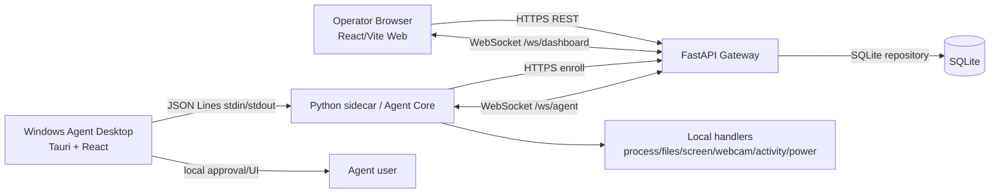

# RemoteCtrl: Context Báo Cáo Đồ Án Mạng Máy Tính

> Tài liệu này được trích xuất từ source code, test, script, cấu hình và tài liệu trong repository hiện tại. Không sửa code, không build, không commit hoặc push trong quá trình tạo tài liệu. Credential, token và dữ liệu cá nhân được thay bằng `[REDACTED]`.

## Quy ước mức độ xác nhận

- **Đã xác nhận từ source**: có căn cứ trực tiếp từ file/module.
- **Đã xác nhận từ test/script**: có test hoặc script mô tả/kiểm tra luồng đó.
- **Suy luận kiến trúc**: kết luận hợp lý từ cách các module kết nối nhưng không phải một assertion độc lập.
- **Chưa xác minh trong lần đọc này**: cần nhóm chạy lại hoặc kiểm tra thủ công.

## 1. Tổng quan project

### Tên và bài toán

RemoteCtrl là nền tảng remote-control/support cho một hoặc nhiều máy Windows Agent qua Gateway. Project phục vụ đồ án môn Mạng máy tính, tập trung vào kết nối WebSocket hai chiều, định tuyến command, truyền dữ liệu realtime và cơ chế consent tại máy bị điều khiển.

**Căn cứ:** `README.md`, `docs/ARCHITECTURE.md`, `backend/app/main.py`, `agent/remotectrl_agent/core/client.py`.

### Mục tiêu

1. Cho Web operator đăng nhập và chọn đúng Windows Agent.
2. Cho Agent kết nối outbound đến Gateway, không cần mở inbound port trên máy Agent.
3. Cho phép thực hiện một tập thao tác có kiểm soát: xem ứng dụng/process, mở/dừng app, xem màn hình, webcam, files, activity và power.
4. Hiển thị trạng thái, kết quả, stream và audit theo thời gian thực.
5. Đặt local approval và privacy làm ranh giới an toàn chính.

### Đối tượng sử dụng

- **Web operator:** người điều khiển từ dashboard.
- **Agent user:** người đang sử dụng máy Windows; người này có quyền approve hoặc deny thao tác.
- **Nhóm phát triển/demo:** dùng dashboard, Agent desktop và các E2E script để trình diễn hệ thống.

### Chức năng chính đã thể hiện trong source

- Authentication dashboard bằng bearer token.
- Tạo enrollment token và enroll Agent một lần.
- Quản lý nhiều Agent, online/offline và xóa record.
- Applications, Processes, Screen, Webcam, Files, Activity Capture và Power.
- Approval một lần hoặc theo phiên hiện tại.
- Audit command/approval/result/session/stream.
- Live screen/webcam qua JPEG và WebSocket.
- Tauri desktop chứa Python Agent Core sidecar.

### Phạm vi đã làm và chưa làm

**Đã có trong source:** remote command catalog, local approval, allowed folders, protected process list, stream frame routing, activity event, dry-run/real power flag, packaging NSIS và public Render configuration.

**Chưa nên mô tả là production hoàn chỉnh:** WebRTC, remote mouse/keyboard control, hidden keylogger, persistent “never ask again”, RBAC nhiều vai trò, device attestation, signed update, PostgreSQL production persistence, rate limiting và hardening đầy đủ.

**Căn cứ:** `README.md`, `docs/SECURITY_NOTES.md`, `docs/ROADMAP.md`.

## 2. Kiến trúc hệ thống



### Thành phần

| Thành phần | Vai trò |
|---|---|
| Web Dashboard | UI React/Vite để login, chọn Agent, tạo command, hiển thị result, stream, session state và audit. |
| FastAPI Gateway | REST API, authentication, command catalog, repository, WebSocket endpoint và router trung tâm. |
| SQLite | Lưu users, agents, enrollment tokens dạng hash, commands và audit events. |
| Windows Agent Desktop | Ứng dụng Tauri cho UI local, approval dialog, settings, allowed folders, power safety, tray/child windows. |
| Python sidecar | Chạy Agent Core; nhận request từ Tauri qua JSON Lines và trả event/response. |
| Agent Core | WebSocket client, command handler, local session state, approval decision, stream và activity event. |

### Luồng dữ liệu chính

1. Operator login tại Web bằng `POST /api/auth/login`.
2. Web tạo enrollment token qua `POST /api/enrollment-tokens`.
3. Agent user nhập Gateway URL và token trong Tauri Settings.
4. Sidecar gọi `POST /api/agents/enroll`; Gateway trả `agent_id` và Agent token.
5. Sau khi local user bấm Connect, Agent mở `wss://.../ws/agent` và gửi Agent token trong message `authenticate` đầu tiên.
6. Web tạo command với `agent_id`; Gateway lưu command, audit rồi gửi command vào đúng socket của Agent đó.
7. Agent kiểm tra approval. Nếu cần, Tauri mở approval window.
8. Agent gửi `approval_response`, sau đó thực thi handler và gửi `command_result`, `stream_frame`, session/event tương ứng.
9. Gateway kiểm tra ownership, cập nhật SQLite và broadcast tới dashboard WebSocket.

### Multi-Agent routing

Gateway giữ map `agent_id -> WebSocket` trong `SessionManager`. Khi tạo command, `agent_id` lấy từ request Web và được dùng để gửi exact socket. Khi Agent gửi result/approval/frame, Gateway kiểm tra command đó có cùng `agent_id` hay không; mismatch bị audit và bỏ qua.

**Căn cứ:** `backend/app/services/session_manager.py`, `backend/app/main.py`, `backend/tests/test_websocket_routing.py`.

## 3. Công nghệ sử dụng

| Công nghệ/thư viện | Vị trí | Tác dụng | Căn cứ/lý do |
|---|---|---|---|
| Python | `backend/`, `agent/`, `scripts/` | Gateway, Agent Core, handler, test và E2E. | Source trực tiếp. |
| FastAPI | `backend/app/main.py` | REST API, dependency injection, WebSocket endpoint, lifespan. | Source trực tiếp; phù hợp API async. |
| Pydantic v2 | `backend/app/schemas.py` | Validate request/response và command status. | `backend/requirements.txt`. |
| Uvicorn | `backend/`/Dockerfile | ASGI server chạy FastAPI. | Dockerfile và requirements. |
| REST/HTTP | `/api/*` | Login, enrollment, agent list, command và audit query. | `backend/app/main.py`, `web/src/lib/api.ts`. |
| WebSocket | `/ws/dashboard`, `/ws/agent` | Kênh persistent bidirectional cho command/result/realtime. | `backend/app/main.py`, `agent/core/client.py`. |
| SQLite | `backend/app/core/db.py` | Persistence demo cho users, agents, tokens, commands, audit. | Database schema và `REMOTECTRL_DB`. |
| React 19 | `web/`, `agent-desktop/` | Component UI dashboard và desktop. | `package.json`. |
| TypeScript | `web/`, `agent-desktop/` | Type-safe UI state, API và bridge message. | `tsconfig`, source `.tsx/.ts`. |
| Vite | `web/`, `agent-desktop/` | Dev server và production bundle. | `package.json`, `vite.config`. |
| CSS custom | `web/src/styles.css`, desktop CSS | Row-first Web UI và theme desktop. | Source trực tiếp. |
| Lucide React | Web và desktop | Icon cho modules, actions và status. | Imports trong `.tsx`. |
| Radix/shadcn-style primitives | `agent-desktop/src/components/ui/` | Card, Button, Dialog, Switch, Tooltip, Sidebar, ScrollArea, Toast. | Radix dependencies và component files. |
| Tauri 2 | `agent-desktop/src-tauri/` | Desktop shell, child WebView windows, tray/plugin và NSIS bundling. | `Cargo.toml`, `tauri.conf.json`. |
| Rust | `agent-desktop/src-tauri/` | Native Tauri host và lifecycle. | Cargo project. |
| WebView2 | Tauri Windows runtime | Render React desktop UI; installer có embedded bootstrapper. | `tauri.conf.json`, `docs/AGENT_DESKTOP.md`. |
| PyInstaller | `scripts/package_agent_core.ps1` | Đóng gói Python sidecar thành executable. | Packaging script. |
| NSIS | Tauri bundle | Tạo Windows installer. | Tauri target `nsis`. |
| Pillow/ImageGrab | Agent handlers | Chụp màn hình và encode JPEG. | `handlers.py`, requirements. |
| WebView2 camera backend | `agent-desktop/src/lib/webcam.ts` | Camera capture trong desktop, giảm phụ thuộc OpenCV trên client. | App bridge và AgentClient webcam callbacks. |
| OpenCV | Có trong packaging/history và diagnostics; webcam hiện tại ưu tiên WebView2 | Có thể được bundle cho backend/legacy path, nhưng luồng desktop hiện tại dùng WebView2. | `docs/AGENT_DESKTOP.md`, `agent/tests/test_actions_and_streams.py`. |
| psutil | Agent handlers/activity | Process list/kill, CPU, uptime, battery và active window process. | `agent/requirements.txt`, `handlers.py`. |
| pynput | `activity.py` | Listener keyboard/mouse cho visible Activity Capture. | requirements và source. |
| requests/websocket-client | Agent Core | HTTP enrollment và WebSocket client. | `agent/core/client.py`. |
| pytest/pywinauto/Playwright | tests/scripts | Unit, desktop UI smoke và packaged Web-Agent E2E. | `requirements-dev.txt`, scripts. |
| Docker/Render | `Dockerfile`, `render.yaml` | Public deployment một service gồm Web static, FastAPI và WebSocket. | Deployment docs/config. |

## 4. Các module chức năng

### Authentication

`POST /api/auth/login` nhận email/password, kiểm tra password hash và trả bearer token có thời hạn. Web lưu bearer token trong `sessionStorage` theo implementation hiện tại và gửi `Authorization: Bearer ...` cho protected REST endpoints.

**Căn cứ:** `backend/app/main.py`, `backend/app/core/security.py`, `web/src/lib/api.ts`.

### Enrollment token

Dashboard tạo token ngẫu nhiên. Repository chỉ lưu SHA-256 hash; raw token chỉ trả về lúc tạo. Agent gửi token tới `/api/agents/enroll`; token one-time bị đánh dấu `used_at` và dùng lại sẽ bị từ chối. Gateway sinh Agent token riêng, cũng chỉ lưu hash.

### Applications

- `app.list`: enumerate visible Windows của người dùng, loại cửa sổ Agent.
- `app.start`: preset allowlist như Notepad, Calculator, Paint, Explorer, Chrome/Brave; hỗ trợ `focus_existing` hoặc `new_instance`.
- app.stop receives a logical app_key, closes every visible window for that application, then guarded-terminates remaining processes; Explorer and shared Windows hosts are never terminated.

Kết quả Applications được gom theo logical app, mỗi app có app_key, display name và số visible windows; UI không hiển thị PID hoặc tab title. Raw windows chỉ được Agent dùng nội bộ cho focus-existing và Close all.

### Processes

`process.list` trả `items` process nền từ psutil/tasklist và `apps` visible windows. Mỗi process có PID, name, status, CPU và memory nếu psutil cung cấp. `process.kill` chặn protected names như `system`, `csrss.exe`, `lsass.exe`, `svchost.exe`, `explorer.exe`.

### Screen

- `screen.screenshot`: dùng Pillow `ImageGrab`, encode JPEG base64.
- `screen.live.start`: tạo worker thread, lấy frame theo FPS và gửi `stream_frame` liên tục.
- `screen.live.stop`: dừng stream tương ứng.

Screenshot có thể yêu cầu Tauri hide approval windows trước khi capture; live screen được thiết kế giữ main Agent window hiển thị. Web tách still preview và live frame.

### Webcam

Web gọi `webcam.list` để chẩn đoán. Desktop Tauri cung cấp local camera service qua WebView2; sidecar nhận frame từ bridge rồi forward thành `stream_frame`. Có các lệnh list, snapshot, live start/stop. Khi camera không có/quyền bị từ chối, Agent gửi lỗi lên Gateway để Web hiển thị.

### Files và allowed folders

Agent user chọn folder trong Access & Privacy. `config.allowed_folders` là whitelist. `files.roots` trả các root đã cấp; `files.list` chỉ cho root hoặc descendant hợp lệ; `_safe_path_with_root` resolve path và từ chối path ngoài root. Hidden/system entries bị lọc. `files.download` giới hạn demo 10 MB và trả name, MIME, path, base64 data để Web tạo Blob download.

### Activity Capture

Đây là visible, session-scoped capture, không phải hidden keylogger. `ActivityCapture` dùng `pynput` để thu keyboard/mouse, theo dõi active window bằng timer và gửi `activity.event` realtime. Events gồm session start/stop, active window change, mouse click, keyboard shortcut, keyboard key và keyboard text. Text buffer có segment id, window context và hỗ trợ backspace trong segment; bộ nhớ giới hạn 1.000 event.

### Power

`power.status` đọc uptime, CPU, battery và trạng thái dry-run. `power.shutdown`, `power.restart`, `power.sleep` dùng Windows invocation khi real power được bật; mặc định trả `dry_run`. Khi `dry_run_power=false`, handler dùng `subprocess.Popen` với argument list, không dùng shell string. Đây là thao tác nguy hiểm và phải test mock trong môi trường phát triển.

### Audit log

Gateway ghi audit cho login, enrollment, command created, approval response, command result, stream lifecycle, metadata/session/config events và ownership mismatch. Audit gắn actor/agent/command và JSON detail.

### Agent session state

Session manager theo dõi screen, webcam và activity theo `agent_id`. Agent gửi `agent_session_state`; dashboard cũng nhận snapshot khi mở WebSocket. Disconnect/reconnect phải reconcile session state về trạng thái thực tế.

## 5. Protocol và API

### REST endpoints

| Method | Endpoint | Chức năng | Auth |
|---|---|---|---|
| GET | `/api/health` | Health check Gateway. | Không |
| GET | `/api/bootstrap` | Capability catalog và safety metadata. | Theo implementation hiện tại dùng bootstrap public/config path. |
| POST | `/api/auth/login` | Login, trả bearer token. | Không |
| POST | `/api/enrollment-tokens` | Tạo enrollment token. | Có |
| POST | `/api/agents/enroll` | Enroll Agent bằng one-time token. | Token riêng |
| GET | `/api/agents` | Danh sách Agent và status. | Có |
| DELETE | `/api/agents/offline` | Xóa record offline. | Có |
| DELETE | `/api/agents/{agent_id}` | Xóa Agent; online socket bị đóng. | Có |
| POST | `/api/commands` | Tạo và gửi command tới Agent cụ thể. | Có |
| GET | `/api/commands` | Lịch sử command. | Có |
| GET | `/api/agents/{agent_id}/commands` | Command theo Agent. | Có |
| GET | `/api/audit` | Audit events. | Có |
| POST/WS | `/api/auth/ws-ticket`, `/ws/dashboard?ticket=...` | Cấp ticket một lần rồi broadcast dashboard event và session snapshot. | Bearer cho ticket endpoint; ticket 30 giây, dùng một lần |
| WS | `/ws/agent` | Agent gửi message `authenticate` đầu tiên rồi nhận command. | Agent token trong WSS payload, không nằm trên URL |

**Căn cứ:** decorators trong `backend/app/main.py` và client trong `web/src/lib/api.ts`.

### Command request

```json
{
  "command_id": "uuid",
  "agent_id": "uuid",
  "type": "process.list",
  "payload": {},
  "requires_approval": true,
  "status": "queued",
  "created_by": "user_id",
  "created_at": "iso_timestamp"
}
```

### Approval response

```json
{
  "type": "approval_response",
  "command_id": "uuid",
  "agent_id": "uuid",
  "approved": true,
  "approval_mode": "prompt_once|session_cached",
  "policy_scope": "single_command|current_session"
}
```

### Command result

```json
{
  "type": "command_result",
  "command_id": "uuid",
  "agent_id": "uuid",
  "ok": true,
  "payload": {},
  "error": null
}
```

### Stream frame và trạng thái

```json
{
  "type": "stream_frame",
  "command_id": "uuid",
  "agent_id": "uuid",
  "stream": "screen|webcam",
  "mime": "image/jpeg",
  "frame": "base64",
  "frame_index": 1,
  "sent_at": "unix_timestamp"
}
```

`stream_status` biểu diễn `running`, `stopped` hoặc `failed`; dashboard dùng key `agent_id + stream` để tránh trộn frame giữa nhiều máy. `agent_session_state`, `agent_metadata`, `agent_config_invalidated`, `activity_event` và `agent_command_error` là các event realtime khác.

### Command lifecycle

```text
queued -> sent -> pending_approval -> running -> succeeded
                                   \-> denied
                 offline/error ----> failed
```

Command không nhạy cảm có thể đi `queued -> sent -> running/succeeded`; command nhạy cảm phải chờ approval. Repository cập nhật status và audit. Nếu Agent offline, Gateway trả failed rõ ràng.

### Ownership check

`handle_agent_message` gọi `_agent_owns_command`: command phải tồn tại và `command.agent_id == websocket_agent_id`. Check này áp dụng cho approval response, command result, stream status và stream frame. Đây là cơ chế chống Agent A cập nhật command của Agent B.

## 6. Consent và bảo mật

### Consent-first

Các command protected được liệt kê trong `APPROVAL_REQUIRED_COMMANDS`, gồm app/process listing và control, files, screenshot/stream, webcam, activity/key capture và power. Stop stream/session cũng được đánh dấu cần approval theo repository hiện tại.

Agent user có thể:

- **Allow once:** chỉ command hiện tại.
- **Allow for this session:** cache theo command type và resource đã duyệt đến khi disconnect/restart/manual reset.
- **Deny:** command không chạy và trả denied.
- Approval window không cho đóng bằng X/Alt+F4; người dùng phải chọn Deny, Allow once hoặc Allow for this session.

Session cache không được dùng chéo action hoặc resource. Approval scope gồm command type và resource quan trọng như app preset/mode, app key, PID, file path hoặc camera device.

### Các lớp bảo vệ

- Enrollment token và Agent token lưu dạng hash, không lưu raw token.
- Command catalog từ chối command type không hỗ trợ.
- File path resolve và kiểm tra nằm trong allowed root.
- Process protected list ngăn terminate process hệ thống.
- Power dry-run bật mặc định; real mode do Agent user bật local.
- Audit trail ghi hành động và approval.
- Agent kết nối outbound, không mở local HTTP service.

### Giới hạn bảo mật còn lại

Đây là demo/prototype, không nên mô tả là production-secure. `docs/SECURITY_NOTES.md` nêu các khoảng trống: cần TLS/cookie hardening đầy đủ, PostgreSQL cho persistence, Argon2id thay PBKDF2 demo trước production, RBAC, device attestation, signed builds/updates, rate limiting và IP allowlist. Cấu hình dev có fallback secret/demo settings; deployment thật phải override bằng environment variables và không commit secret.

## 7. Realtime và liên hệ Mạng máy tính

### TCP/WebSocket

WebSocket chạy trên TCP và tạo kết nối persistent. Sau handshake, hai phía có thể gửi message bất kỳ lúc nào: Gateway gửi command, Agent gửi approval/result/frame/event. Dashboard có một WebSocket riêng để nhận broadcast.

### Routing và online detection

`SessionManager` map `agent_id` tới socket hiện tại. Khi handshake hợp lệ, Agent được đánh dấu online; khi socket mất, record chuyển offline. Telemetry định kỳ giúp Gateway nhận biết kết nối còn sống. Reconnect hiện được thực hiện sau khi local user đã chủ động Connect; `AgentClient` dùng delays 1, 2, 5, 10, 20, 30 giây cho disconnect bất thường.

### FPS, latency và bandwidth

Mỗi frame là JPEG base64 trong JSON WebSocket. Base64 làm dữ liệu lớn hơn khoảng 33% so với binary JPEG. Với FPS là `F` và kích thước frame JPEG là `S` byte, bandwidth xấp xỉ:

\[
  B \approx F \times S \times \frac{4}{3}
\]

chưa tính JSON/WebSocket/TCP overhead. Screen stream mặc định được giới hạn khoảng 1--15 FPS tùy payload; webcam phụ thuộc camera service và payload. Đây là lý do Render Free/LAN có thể lag nếu FPS hoặc quality cao.

### Độ phức tạp

| Tác vụ | Thời gian | Bộ nhớ | Ghi chú |
|---|---:|---:|---|
| Process list | `O(n)` | `O(n)` | `n` là số process; kết quả cắt tối đa 250 item trong psutil path. |
| Visible app list | `O(w)` | `O(w)` | `w` là số top-level window được enumerate; cắt tối đa 250. |
| File list | `O(m)` | `O(m)` | `m` là entry trong directory; trả tối đa 500. |
| File download | `O(S)` | `O(S)` | Đọc file và base64; giới hạn demo 10 MB. |
| Screen/webcam frame | `O(S)` mỗi frame | `O(S)` | `S` là kích thước ảnh sau encode; tổng stream `O(F*S)`. |
| Gateway routing | Trung bình `O(1)` | `O(a)` | Map socket theo `agent_id`, `a` là số Agent online. |
| Activity event | `O(1)` append | `O(k)` | deque tối đa 1.000 events. |

## 8. Deployment và cách chạy

### Local development

1. Tạo Python virtual environments cho `backend/` và `agent/`.
2. Cài `backend/requirements.txt`, `agent/requirements.txt`; dev cài thêm `agent/requirements-dev.txt`.
3. Chạy FastAPI bằng Uvicorn trên port local mặc định 8000.
4. Chạy Web Vite trên port 5173; Web dùng same-origin production hoặc `VITE_API_BASE` override.
5. Build desktop sidecar trước, sau đó chạy Tauri dev/build.

Các script hỗ trợ: `scripts/start_dev.ps1`, `scripts/verify_all.ps1`, `scripts/package_agent_core.ps1`, `scripts/package_agent_desktop.ps1`.

### Public Render

`Dockerfile` build Web bằng Node 24, sau đó dùng Python 3.12 slim để chạy FastAPI và serve `web/dist`. Uvicorn bind `0.0.0.0` và port `$PORT`. `render.yaml` tạo một Render Web Service free với health path `/api/health`.

Environment variable cần cấu hình, không ghi giá trị:

```text
REMOTECTRL_SECRET_KEY=[REDACTED]
REMOTECTRL_ADMIN_EMAIL=[REDACTED]
REMOTECTRL_ADMIN_PASSWORD=[REDACTED]
REMOTECTRL_CORS_ORIGINS=[REDACTED]
REMOTECTRL_DB=/tmp/remotectrl.db
```

Web public dùng same-origin API và đổi `https` thành `wss` cho dashboard WebSocket. Agent khác mạng nhập public HTTPS Gateway URL, enroll bằng token mới rồi bấm Connect.

### Build và installer

- Web: trong `web/`, chạy `npm run build`.
- Python sidecar: `scripts/package_agent_core.ps1` dùng PyInstaller one-file, collect NumPy/PIL, hidden imports cho pynput và loại PySide6/Tkinter.
- Tauri/NSIS: `scripts/package_agent_desktop.ps1` build frontend, package sidecar, chạy Tauri build với target `nsis`, copy installer vào `release/RemoteCtrlAgent-Setup.exe`.
- Checksum: script tạo `release/RemoteCtrlAgent-Setup.exe.sha256`; có thể xác minh bằng `Get-FileHash -Algorithm SHA256 release\RemoteCtrlAgent-Setup.exe` và so với hash trong file.
- Tauri dùng WebView2 embedded bootstrapper. Installer chưa được code-sign theo tài liệu; Windows SmartScreen có thể cảnh báo.

### Giới hạn Render Free và SQLite

Render Free có thể spin down sau thời gian idle. SQLite đặt tại filesystem tạm `/tmp`, nên dữ liệu demo có thể mất sau restart/redeploy. Khi đó có thể phải login/enroll lại. Đây là chấp nhận được cho demo môn học, nhưng không phải persistence production.

## 9. Testing và QA

### Backend tests

`backend/tests/` gồm repository, API login/enrollment/agent deletion/offline command, security password/token, session manager reconnect identity và WebSocket routing. Có regression kiểm tra hai Agent, ownership mismatch, metadata/session/config events và stream ownership.

### Agent tests

`agent/tests/` gồm:

- config migration và allowed folders;
- path traversal/hidden file;
- enrollment error và Render URL guidance;
- explicit connect/disconnect/reconnect;
- sidecar state không lộ Agent token;
- process/app/preset/focus/protected kill;
- screen stream start/stop/duplicate;
- session approval metadata và command-specific cache;
- power dry-run/real invocation mock;
- WebView2 webcam frame forwarding không cần OpenCV path;
- Agent window exclusion và screenshot approval hiding;
- Activity text, active window, click và Backspace segment.

### E2E/UI scripts

- `scripts/e2e_mock_agent.py`: kiểm tra Gateway bằng mock Agent.
- `scripts/e2e_headless_agent.py`: kiểm tra health/enrollment/command với headless Agent flow.
- `scripts/e2e_web_agent_desktop.py`: Playwright dashboard + packaged Tauri + pywinauto approval, có `--extended`.
- `scripts/ui_smoke_agent.py`: mở executable với APPDATA tạm, kiểm tra UI pages/bridge và đóng lại.
- `scripts/verify_all.ps1`: chạy Python tests, mock/headless E2E, UI smoke, Web build, packaged E2E và kiểm tra MZ header/checksum artifacts.

### Trạng thái xác minh

Source hiện có **54 test cases** theo phép đếm các hàm `test_*` trong `backend/tests` và `agent/tests`. Các script QA và tài liệu mô tả đầy đủ luồng cần chạy. Trong lần tạo context này, theo yêu cầu chỉ đọc, không chạy test/build/E2E mới; vì vậy trạng thái runtime hiện tại phải được xác nhận lại trước khi ghi vào báo cáo nộp cuối.

### Chưa thể xác minh hoàn toàn từ source

- Cài trên một Windows sạch hoàn toàn.
- Các driver/quyền webcam và camera hardware khác nhau.
- Tương thích WebView2 trên mọi bản Windows 10/11.
- Sleep/shutdown/restart thật; chỉ nên mock trong QA thông thường.
- Độ trễ và bandwidth trên mạng Internet cụ thể.
- Render Free có đang online và health endpoint trả 200 tại thời điểm nộp.

## 10. Kết quả, điểm mạnh và hạn chế

### Điểm mạnh

1. Kiến trúc tách Web, Gateway, Agent Core và desktop UI rõ ràng.
2. WebSocket outbound giúp Agent không cần mở inbound port.
3. Routing theo `agent_id` và ownership check giảm nguy cơ nhầm máy.
4. Consent, approval cache theo session, audit và allowed folders được thể hiện xuyên suốt.
5. Có test cho các regression thực tế: duplicate stream, Backspace, multi-Agent routing, local disconnect, path traversal và power mock.
6. Có packaging script, NSIS installer và checksum phục vụ demo.

### Hạn chế/rủi ro

- SQLite trên Render Free có thể mất dữ liệu.
- Bearer token/custom PBKDF2 là mức demo, cần hardening trước production.
- JPEG base64 qua WebSocket tốn bandwidth hơn binary/WebRTC.
- Activity Capture thu keyboard/mouse trong session nên vẫn là chức năng nhạy cảm; phạm vi demo và approval cần giải thích rõ với người dùng.
- Real power action có thể làm mất dữ liệu hoặc ngắt demo; chỉ bật trên Agent user chủ động và không test thật trong QA tự động.
- Webcam phụ thuộc quyền OS, camera driver và WebView2.
- Không có RBAC/role separation đầy đủ; operator đăng nhập demo có quyền điều khiển theo catalog.
- Installer unsigned và chưa có auto-update/signature verification.

### Cải tiến tương lai

1. PostgreSQL managed và migration layer thay SQLite filesystem.
2. Binary WebSocket framing hoặc WebRTC cho media stream.
3. OIDC/2FA, RBAC, short-lived refresh token, rate limit và CSRF/session hardening.
4. Signed installer, signed sidecar, auto-update có verify signature.
5. Device registration/attestation và revoke Agent token.
6. Metrics/observability cho latency, dropped frames, reconnect và command duration.
7. Test matrix trên Windows versions, camera drivers và mạng WAN.

## Thông tin cần nhóm bổ sung trước khi nộp báo cáo

1. Tên thành viên, vai trò từng người và tên giảng viên/lớp.
2. Gateway public URL đang dùng và thời điểm kiểm tra health gần nhất; không đưa password/token vào báo cáo.
3. Kết quả chạy test mới nhất, Web build, Tauri build, NSIS installer và các E2E script.
4. Phiên bản Windows, Node, Python, Rust, WebView2 và trình duyệt dùng trong demo.
5. Kích thước installer, SHA-256 và cách nhóm phát hành file cho tester.
6. Bảng demo acceptance: module nào đã chạy thật, module nào chỉ mock/dry-run.
7. Ảnh/sequence diagram của luồng login -> enrollment -> approval -> command result.
8. Số liệu đo thực tế nếu muốn báo cáo latency/FPS/bandwidth; không tự suy ra từ source.
9. Xác nhận chính sách dữ liệu: Agent nào được phép capture, folder nào được whitelist, thời điểm reset session approval.
10. Các lỗi còn tồn tại sau lần chạy QA cuối cùng, đặc biệt Render Free, camera driver và Windows clean install.
